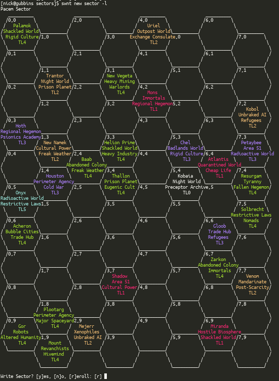

# swnt - Command line tools for Stars Without Number GMs

swnt provides a command line interface to the roll tables and generators found in [Stars Without Number : Revised Edition (free version)](https://www.drivethrurpg.com/product/230009/Stars-Without-Number-Revised-Edition-Free-Version).
While the code is MIT licensed, all roll table content (except the name.System table) is the copyright of [Kevin Crawford, Sine Nominee Publishing](https://sinenominepublishing.com/).

## Features

* Generate sectors up to 99x99 hexes
* Export sectors as
* * plain text (with directory structure)
* * a hugo site using a fork of the docdock theme. This includes indexing and text search support
* * JSON
* Has generators for pretty much all tables in the Free edition of Stars Without Number (I don't think I missed any, let me know if I did)
  
## Installation

You will need the [go compiler](https://golang.org/) to install swnt. Once installed just run

    go get github.com/nboughton/swnt
    go install github.com/nboughton/swnt

swnt should build on other platforms but I'm not able to test them so I can't guarantee it'll work as expected on anything other than linux. At some point I'll provide
a binary download and probably an AUR package for Arch Linux.

To make full use of swnt's hugo export function for generated sectors you'll also need [Hugo](https://gohugo.io)

## Usage

swnt is mostly for rolling on tables and generating content such as sectors, npcs, points of interest, quick encounters etc:

    swnt new sector

new sector takes a few options that you might want to play around with:

```
swnt new sector -h
Create the skeleton of a Sector

Usage:
  swnt new sector [flags]

Flags:
  -x, --exclude stringArray       Exclude tags (-x zombies -x "regional hegemon" etc)
      --export string             Set export formats. (--export text,hugo,json) format types must be comma separated without spaces. (default "text")
  -h, --help                      help for sector
  -o, --other-worlds-chance int   Set % chance for a secondary world to be generated for any given star in the sector (default 10)
  -p, --poi-chance int            Set % chance of a POI being generated for any given star in the sector (default 30)
  -e, --sector-height int         Set height of sector in hexes (default 10)
  -w, --sector-width int          Set width of sector in hexes (default 8)
```

Note new sector doesn't support the --format flag as export formats are covered by the export flag and output differently.

Make sure you use a monospace font in your terminal otherwise the output won't line up properly.



All commands can be queried for their available options with the -h flag. For example:


```
[nick@gubbins swnt]$ swnt -h
A simple application for generating content for Stars Without Number

Usage:
  swnt [command]

Available Commands:
  bestiary    List creature statblocks
  help        Help about any command
  new         Generate content
  react       Make a reaction roll for an NPC
  show        Print the text of a world tag, table text will be added in future

Flags:
  -h, --help   help for swnt

Use "swnt [command] --help" for more information about a command.
```

Most sub-commands of "new" (and the bestiary) support markdown as an output option with the -f (--format) flag. This makes it easier to copy and paste content straight into a Hugo exported sector.

## FAQ

### Why not make a web app?

Because [Sectors Without Number](https://sectorswithoutnumber.com/) already exists and is an awesome tool. Also, I live on the CLI. It's where I work, where I'm comfortable and I suspect I'm not alone in that. swnt lets me just hammer a few keys and instantly get something back without having to faff around with GUIs and that's how I like it. I also like using screenshots of the player maps as my actual maps in Roll20. It's got that awful 80s retro-scifi look that just burns the retinas in all the right ways.
